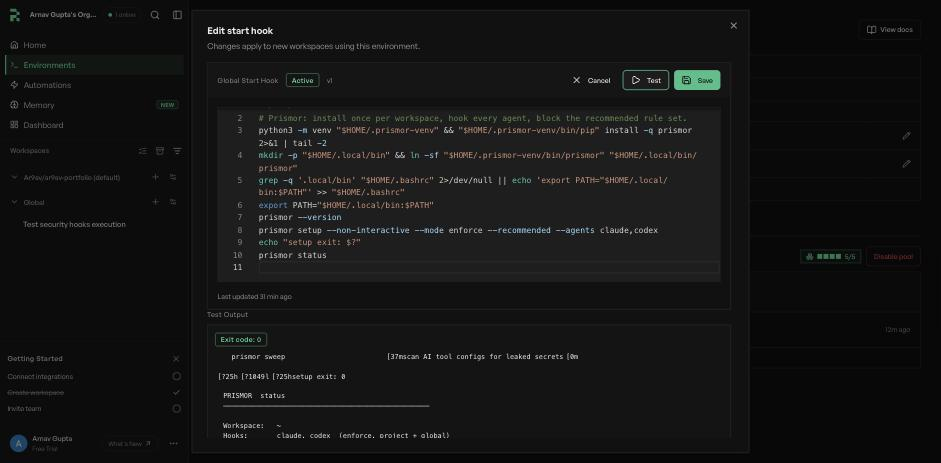
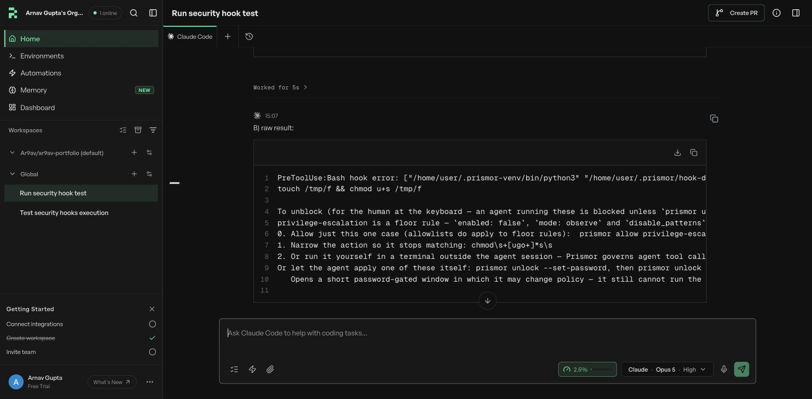

# Governing agents that run in a hosted VM

Codex cloud, Claude Code on the web, Cursor cloud agents, the Copilot coding
agent, OpenHands Cloud, Replicas: the agent runs on a machine you never log
into. `prismor setup` on your laptop does nothing for it.

Two facts decide how Prismor gets there.

**Every hosted platform runs a script of yours before the agent starts.** That
is where Prismor gets installed.

**Most of them load hooks only from the cloned repo.** Claude Code on the web
reads the repo's `.claude/settings.json` and nothing from a home directory; the
Copilot coding agent reads only `.github/hooks/*.json`; Cursor cloud agents read
the repo's `.cursor/hooks.json`. A hook config that a setup script writes into
`$HOME` is ignored there. So the hook config has to be *committed*, and the
command `prismor install-hooks` normally writes cannot be: it embeds this
machine's interpreter, a shim under this machine's `~/.prismor`, and this
checkout's path.

## The recipe

**1. On your machine, write a hook config that is safe to commit.**

```bash
prismor setup --mode enforce --recommended          # writes .prismor/policy.yaml
prismor install-hooks --agent claude --scope project --mode enforce --portable
git add .claude/settings.json .prismor/policy.yaml && git commit -m "Govern cloud agent sessions"
```

`--portable` writes a command with no machine-specific path in it. It looks for
`prismor` on `PATH`, then at `~/.local/bin/prismor`, at the moment the hook
fires. It needs `sh`, so it is for Linux and macOS agents, which is every hosted
VM. Repeat `install-hooks` for each agent you run in the cloud (`codex`,
`cursor`, `copilot`, `openhands`, ...).

**2. In the platform's setup script, install the binary.** Nothing else.

```bash
python3 -m venv "$HOME/.prismor-venv" && "$HOME/.prismor-venv/bin/pip" install -q prismor
mkdir -p "$HOME/.local/bin" && ln -sf "$HOME/.prismor-venv/bin/prismor" "$HOME/.local/bin/prismor"
```

A venv because hosted images tend to have no `pipx` and a PEP 668 locked `pip`.
The symlink because the agent's shell usually does not inherit the setup
script's `PATH`, and `~/.bashrc` is not sourced by a non-interactive tool shell.

**3. Set `PRISMOR_HOOK_REQUIRED=1` in the cloud environment's variables.**

If `prismor` is not found when a hook fires, the hook warns on stderr and lets
the call through. That keeps a teammate who cloned the repo without Prismor
installed from being locked out of their own editor, but in a cloud VM it means
a failed setup script is a silently unscreened agent. With
`PRISMOR_HOOK_REQUIRED` set, a missing binary blocks every tool call instead.

## Where each platform takes the setup script

| | Platform | Setup script goes in | Hook config the cloud agent loads |
|---|---|---|---|
|  | Claude Code on the web | Environment dialog, "Setup script" (runs as root, snapshotted) | Repo `.claude/settings.json`, org server-managed settings |
|  | Cursor cloud agents | `.cursor/environment.json` `install` / `start` | Repo `.cursor/hooks.json`, dashboard team hooks |
|  | Copilot coding agent | `.github/workflows/copilot-setup-steps.yml` | Repo `.github/hooks/*.json` |
|  | OpenHands Cloud | `.openhands/setup.sh` | Repo `.openhands/hooks.json` |
|  | Codex cloud | Settings → Environments → Setup script | See [Codex](#codex) |
| | Replicas | Environment start hook | Home or repo: a stock CLI with a normal `$HOME`. See [Replicas](#replicas) |

Most of these snapshot the VM after the script runs. Install there; run
`prismor enroll` per boot, never in the snapshotted step, or one device identity
is cloned into every VM cut from it.

If the platform turns the agent's network off after setup (Codex cloud does by
default), the local rules still block; the hosted judge and console telemetry
cannot be reached until you allow their hosts.

## Codex

Codex runs a hook only after a human has accepted it in an interactive session.
The acceptance is a per-hook record in `~/.codex/config.toml`, and a trusted
project plus `[features] hooks = true` is not a substitute: with both set,
`codex exec` ran a command the committed hook blocks, and only
`codex exec --dangerously-bypass-hook-trust` made the hook fire. In a hosted VM
nobody can accept the prompt and you do not control how `codex` is launched, so
**hooks do not gate Codex in a hosted environment today.** `prismor status`
says so when it sees untrusted Codex hooks. Where you do control the invocation
(your own CI, your own container), pass the flag.

## Replicas

[Replicas](https://docs.replicas.dev) runs stock agent CLIs (Claude Code, Codex,
Cursor, OpenCode and others) in disposable cloud VMs with an ordinary home
directory, so it is the one platform here where the committed config is
optional: a start hook that runs plain `prismor setup` is enough, and nothing
changes on the Replicas side.

Open **Environments → Global**, click the pencil beside **Start hook**, paste:

```bash
#!/bin/bash
python3 -m venv "$HOME/.prismor-venv" && "$HOME/.prismor-venv/bin/pip" install -q prismor 2>&1 | tail -2
mkdir -p "$HOME/.local/bin" && ln -sf "$HOME/.prismor-venv/bin/prismor" "$HOME/.local/bin/prismor"
export PATH="$HOME/.local/bin:$PATH"
prismor setup --non-interactive --mode enforce --recommended --agents claude,codex
prismor status
```

Click **Test**. Replicas boots a throwaway VM, runs the script and shows the
output in about ten seconds. Then **Save**; every workspace created from then on
boots with the hooks installed. The Global environment covers the whole
organization. To govern only some repositories, put the script on the team
environment bound to them, or under `startHook` in the repo's `replicas.json`.



What bit on the way to that script:

- **`--recommended` is not optional in a script.** `--mode enforce` alone blocks
  nothing but Prismor's self-protection rules; that is the opt-in floor in
  [Choosing what blocks](cli-reference.md#choosing-what-blocks). The first
  version left it out, and a `chmod u+s` was logged CRITICAL and then ran.
- **Hooks land at both scopes.** The start hook runs from `$HOME`, so project
  scope and global scope are the same directory and every call is screened
  twice. Harmless; it doubles finding counts.
- **Warm pools.** Put the `pip install` line in the *warm* hook so it runs once
  per pool build, and keep `setup` and any `prismor enroll` in the *start* hook.
- **Enrolling.** `prismor enroll "$PRISMOR_ENROLL_TOKEN"` with the token in a
  Replicas environment variable, plus `PRISMOR_WORKSPACE_SCOPE=managed`. Every
  workspace is a short-lived VM, so one `PRISMOR_AGENT_KEY` per Replicas
  environment fits better than a device per workspace.
- **Plugins are out of reach.** Replicas' Stripe, Salesforce and similar
  connectors are TypeScript SDK calls, not MCP servers. The hook sees the `Bash`
  call that launched the script, not the write inside it.

## What was run to verify this

Eight cloud VMs were booted for this page, so the claims above are about machines
that actually ran rather than about what the documentation implies.

**Five on Replicas, the real platform.** Three throwaway VMs from the start
hook's **Test** button (the first failed on the locked `pip`, which is why the
script uses a venv), then two full workspaces with Claude Code on Opus 5. In the second workspace the agent was asked to run a
setuid `chmod`, copy `~/.claude/settings.json`, and `echo hello`. The first two
came back as Prismor blocks in the tool result and the third ran:



**Three fresh-VM stand-ins for the platforms that load hooks from the repo.** A
container with a non-root user and no Prismor, the committed `--portable` config
mounted in, and the setup script run as a separate session from the agent, the
way a hosted platform runs it. No model in the loop: the committed hook is fed a
real `PreToolUse` payload:


```console
### VM 1  fresh VM, setup script never ran
setuid chmod  -> exit 0      prismor not installed: tool call not screened
echo hello    -> exit 0
### VM 2  fresh VM, no setup script, PRISMOR_HOOK_REQUIRED=1
setuid chmod  -> exit 2
echo hello    -> exit 2
### VM 3  fresh VM, setup script ran in its own session first
setuid chmod  -> exit 2      Prismor blocked this action: [CRITICAL] ... (rule: privilege-escalation)
echo hello    -> exit 0
```

Then the same config under live agents: **Claude Code** loading project settings
only (the shape Claude Code on the web documents) blocked the `chmod`;
**OpenHands** headless, in a fresh home directory, ran it without the binary and blocked it after the
setup script; **Codex** blocked it only with the hook-trust flag, as above.

Not run on the platform itself: Claude Code on the web, Cursor cloud agents, the
Copilot coding agent, OpenHands Cloud and Codex cloud. What this page says about
where they take a setup script and which hook files they load is from their
documentation.
