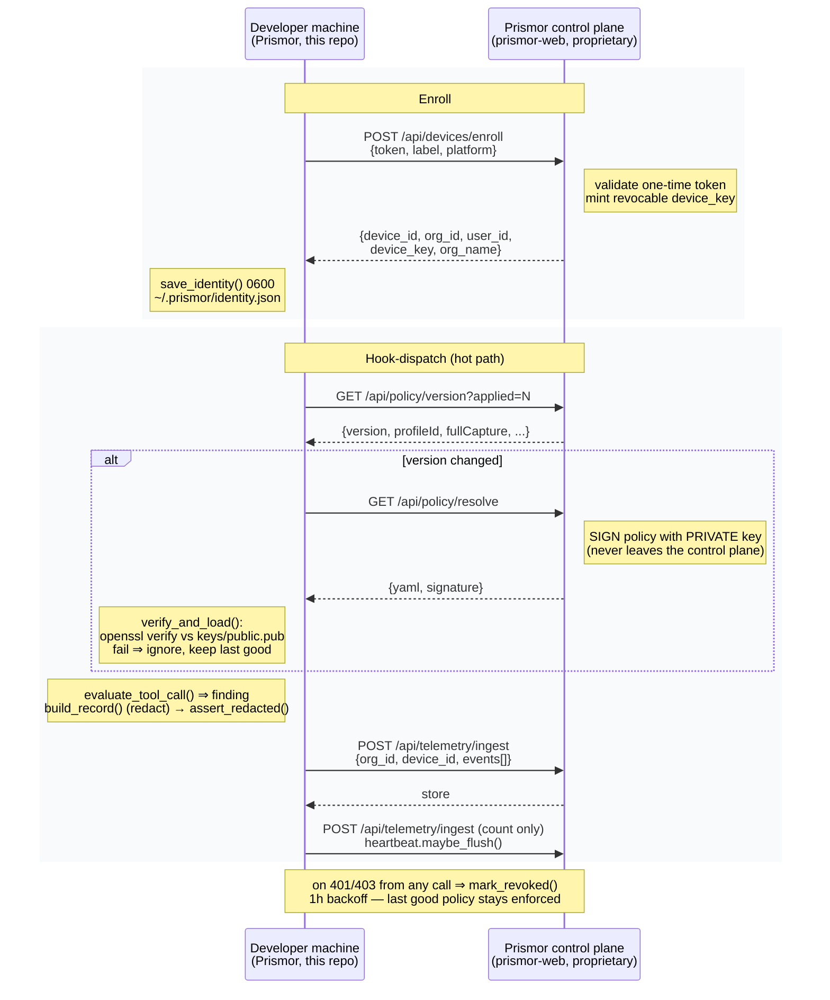

# Connecting a Self-Hosted Runtime to the Prismor Platform

Prismor is open-core. The runtime ("Prismor"), the framework adapters, and the
YAML rule format in this repo are open and auditable. The **control plane**
(`prismor-web` — the org dashboard, the policy-signing private key, and the
premium feed) is proprietary. This document describes the *open client side* of
that link: how an enrolled Prismor install talks to the control plane, what it
trusts, and exactly what does and does not leave the machine.

See also: [docs/sdk-integration.md](sdk-integration.md)
(the runtime, not the SDK, is what connects).

Everything here is **opt-in**. On a plain install, `prismor/runtime/enterprise/*` is the
**client** side and a guarded no-op: `is_enrolled()` returns False and every
control-plane path short-circuits. Local protection — the 63 default rules in
`prismor/runtime/default_policy.yaml` — is always on, enrolled or not.

## Connection lifecycle at a glance



The endpoints above are what the **client calls**; the server implementation
lives in the proprietary control plane.

## 1. Enroll (token → device key)

```
prismor enroll <TOKEN>
prismor enroll --token <TOKEN> --label "ci-runner-3" --api-base https://prismor.dev
```

- **Token:** a one-time enrollment token from the dashboard (Admin → Devices →
  Enroll), exchanged exactly once.
- **What happens:** `identity.enroll()` POSTs `{token, label, platform,
  prismor_version}` to `/api/devices/enroll`; the server returns `device_id`,
  `org_id`, `user_id`, `device_key`, `org_name`.
- **Where the key is stored:** `save_identity()` writes
  `~/.prismor/identity.json` (override via `$PRISMOR_HOME`) at **0600**, dir
  0700. The `device_key` is a long-lived, revocable **bearer credential** for
  telemetry + signed-policy *pull*; it cannot push or sign anything, and it is
  separate from the scan API key and from cloaked secrets so revoking a laptop
  never breaks CI scans.
- After enroll, policy is fetched immediately so admin policy applies on the
  first tool call.

Base URL: `$PRISMOR_API_BASE` (default `https://prismor.dev`), persisted
per-device as `api_base` so self-hosted/staging deployments repoint without a
rebuild.

### Deviceless (SDK / deployed) agents: `$PRISMOR_AGENT_KEY`

A deployed agent — a container, a serverless worker — has no machine to
enroll. Instead an org admin mints an **agent key** in the dashboard
(Connections → “SDK & deployed agents”, or Devices → Service identities) and
wires it into the deployment:

```
PRISMOR_AGENT_KEY=prism_agent_…     # required — the minted key
PRISMOR_AGENT_LABEL="checkout-bot"  # optional — display label
PRISMOR_API_BASE=…                  # optional — self-hosted control plane
```

The runtime treats the env key as a full identity: same bearer credential,
same telemetry upload, signed-policy pull and revocation semantics as a
device key. It is never written to disk, and it takes precedence over a
baked-in `identity.json` so one image can serve many workloads. Server-side
it is a *service identity* — listed, drilled into and revoked exactly like a
device. Headless `prismor enroll <token>` inside the workload remains
equivalent if you prefer token exchange over a long-lived key.

### AWS workloads: `prismor enroll --aws`

A workload on AWS (EC2, ECS/EKS task, Lambda) can skip both the token and the
long-lived key and enroll with the IAM role it already runs as:

```
prismor enroll --aws --org <orgId>        # role must be bound to the org in the console
```

The runtime SigV4-signs an `sts:GetCallerIdentity` request with the role's
credentials and posts the **signed request** — never the credentials — to
`POST /api/devices/enroll/aws`. The control plane replays it to STS, reads the
caller's role ARN and, if an admin bound that role (Admin → Integrations →
Cloud workload identity), mints a service identity with the same payload as a
token enrollment. The signature covers the control-plane host and the org id
and expires after five minutes, so a captured request cannot be replayed
elsewhere. Details: [SSO, provisioning and workload identity](sso-and-provisioning.md).

## 2. Signed remote policy: verify-before-apply, fail-closed

On the hot path, `remote_policy.check_and_refresh()` (debounced, clamped to
[5s, 600s]):

1. **Version probe:** `GET /api/policy/version` with `Authorization: Bearer
   <device_key>`; a change in version/profile/capture/managed-repos triggers a
   pull.
2. **Pull:** `GET /api/policy/resolve` → `{yaml, signature}`.
3. **Verify:** a detached Ed25519 signature checked with `openssl pkeyutl
   -verify` against the bundled trust root `keys/public.pub`. **The private key
   is never in this repo.**
4. **Fail-closed:** an unsigned/tampered/unverifiable policy is *ignored* and the
   last verified policy keeps applying — a compromised control plane cannot
   inject rules.
5. **Tighten-only floor:** the engine enforces `_NON_OVERRIDABLE_RULE_IDS`, so
   even a *valid* signed policy can never disable the destructive-command /
   secret-exfil protections or turn Prismor off.
6. **Offline-safe:** unreachable control plane ⇒ cached policy persists.

## 3. Redacted telemetry (what leaves the box)

Telemetry flows only for **org-managed** workspaces (`workspace_scope.py`).
Personal repos emit nothing — but the local security floor still applies to them;
"personal" removes org visibility and the org overlay, never protection.

Scope is decided by the git remote matching an org-claimed pattern
(`settings.managed_repo_patterns`). That is a developer-privacy convenience,
not a security boundary: a developer can rewrite or drop `origin` so a repo no
longer matches, then mark it personal. Orgs that need every workspace on an
enrolled device governed set `settings.allow_personal_workspaces: false` in the
signed policy — `prismor workspace personal`, `PRISMOR_WORKSPACE_SCOPE=personal`
and the non-claimed-repo default are then all ignored.

The `prismor` sink (`prismor/runtime/sinks.py`) builds
records via `telemetry.build_record()` and runs `assert_redacted()` before upload
— a fail-closed guard.

- **Redacted mode (default):** metadata + enums + hashes only — severity,
  category, rule_id, event type, agent, verdict, a *static* rule title
  (paths/hosts/URLs/secrets stripped), a 16-char `evidence_hash`, tool_name,
  managed-repo context, policy_scope, device_id, session_id, subject (principal
  ids). **Never sent:** commands, stdout/stderr, file paths, URLs, file contents,
  prompts, responses, payloads, matched evidence.
- **Full capture (admin opt-in, per-org):** additionally ships evidence/content,
  still scrubbed through the cloaking secret patterns so registered secrets never
  leave. A flip is surfaced to the developer via a stderr `NOTICE` and in
  `prismor enroll-status` (`capture: FULL`).

Upload: `POST /api/telemetry/ingest`. An offline **spool** gives at-least-once
delivery, written *after* redaction. Short hot-path timeout (~6s) ⇒ a slow
control plane spools, never blocks a tool call. The destination is **pinned to
the enrolled `api_base`** — a local policy cannot redirect the device-key-bearing
upload elsewhere.

## 4. Heartbeat

`heartbeat` counts inspected tool calls locally and uploads one `agent_activity`
record per ≤60s carrying *only a count* + agent/session enums — volume, not
detail — gated to managed workspaces. Powers the "tool calls inspected" KPI.

## 5. Revocation + backoff

Any control-plane **401/403** ⇒ `mark_revoked()`; for 1h, control-plane calls
short-circuit (no hammering). Local protection is unaffected — the last good
signed policy keeps enforcing. `prismor logout` wipes identity, cached policy,
spool, heartbeat, and scope map.

## Trust model

- **Public-key verify only.** The device holds no signing key; it only verifies
  org policy against `keys/public.pub`. The signing key lives in the control
  plane.
- **No secret leaves.** Cloaked secrets and the scan API key are never sent; even
  full capture scrubs secret-shaped values. The device key is scoped, revocable,
  stored 0600.
- **Admin CAN see** (managed repos only): redacted findings, per-user subject
  ids, repo identifiers, tool-call volume; with opt-in, scrubbed raw content.
- **Admin CANNOT see:** personal-repo activity, raw secrets, or — without
  opt-in — any commands, paths, URLs, prompts, or file contents; and cannot
  silently disable the local security floor.

> Known follow-ups for this path: auth on the enroll UX, and subject handling.
