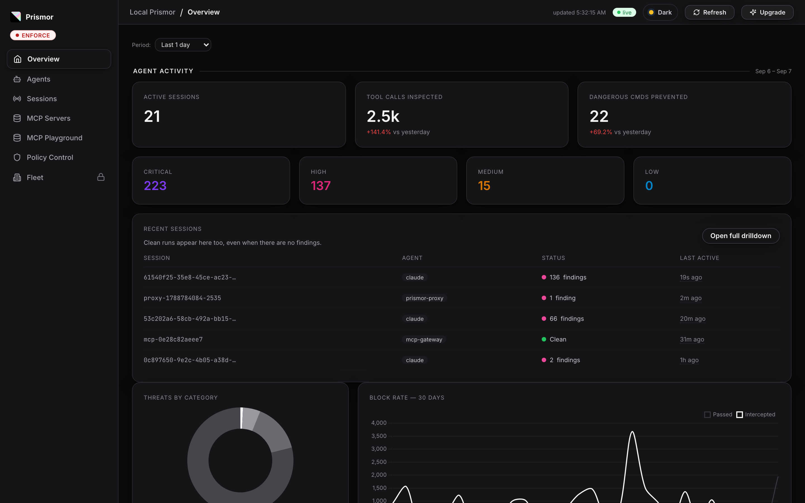
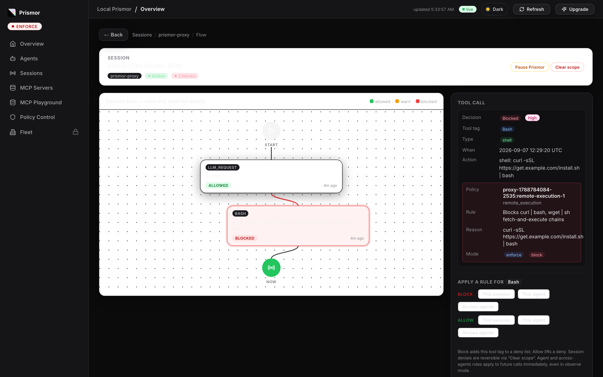

# Deploying Prismor as a service

`prismor proxy` and `prismor eval-server` are long-lived surfaces rather than
per-call hooks: they front an agent Prismor cannot hook, so they run beside it
rather than inside it. `packaging/docker/` holds an image and a compose file
that stand one up next to n8n, wired to your SIEM and to the console.

```bash
cd packaging/docker
cp prismor.env.example prismor.env      # enrollment token, agent name, mode
docker compose up -d
```

Then set the OpenAI credential's **Base URL** inside n8n to
`http://prismor:7080/v1` — the compose network resolves `prismor` — and the
workflow is governed. See [n8n.md](n8n.md) for the walkthrough with
screenshots.

## What the container needs to keep

```yaml
volumes:
  - prismor_home:/var/lib/prismor                                # keep this
  - ./policy.yaml:/var/lib/prismor/.prismor/policy.yaml:ro       # this path exactly
```

`$PRISMOR_HOME` holds the device identity, the session store and the audit
trail. Without a volume, every restart is a new unenrolled device and the trail
starts over.

The policy path is the one that catches people. A workspace's policy is read
from `<workspace>/.prismor/policy.yaml`; mounted one level up, the file is
silently ignored — the surface still enforces the bundled defaults, so it looks
like it is working while no sink you configured ever fires.

## Sending findings to your SIEM

Sinks are declared under `settings.outputs` in that policy file and dispatched
the moment a finding is produced — *before* the block is returned to the agent,
so a SIEM sees denied calls, not just allowed ones. Every sink is best-effort:
one that is down warns on stderr and never blocks a tool call.

```yaml
settings:
  outputs:
    - type: otel                          # any OpenTelemetry collector
      endpoint: http://otel-collector:4318
      headers: { "Authorization": "Bearer ${OTEL_TOKEN}" }
    - type: splunk                        # HEC, OCSF body
      url: https://splunk.example.com:8088/services/collector
      token: ${SPLUNK_HEC_TOKEN}
    - type: prismor                       # the console; needs no config
```

`webhook`, `syslog`, `datadog` and `file` (json / cef / ocsf) are also
available — see [telemetry-sinks.md](telemetry-sinks.md). Every `${VAR}`
resolves from the container's environment, so tokens live in `prismor.env` and
never in the policy file you commit.

A delivered finding carries the rule, the verdict and the identity of what
proposed it:

```json
{ "severity": "HIGH", "category": "remote_execution", "action": "block",
  "agent": "prismor-proxy", "agent_name": "n8n-agent",
  "session_id": "proxy-1788780852-1", "mode": "enforce",
  "title": "Blocks curl | bash, wget | sh fetch-and-execute chains" }
```

## Watching it

Whatever else it reports to, the surface keeps a local view. `prismor
dashboard` serves it from `$PRISMOR_HOME`, so a container's sessions are
readable without a control plane at all:

```bash
docker compose exec prismor prismor dashboard --no-open --host 0.0.0.0
```

A governed n8n agent shows up as its own session, under the agent name the
surface reports:



Opening it gives the turn as the policy engine saw it — the prompt allowed, the
shell command the model proposed blocked, and the rule that decided it:



The right-hand panel is the control half. `Block` / `Allow` apply a rule for
that tool tag to **this session**, **this agent**, or **across agents**, taking
effect on the next call — including in observe mode, which is the useful shape
when you are still deciding what the policy should be. `Pause Prismor` and
`Clear scope` undo, in that order of bluntness.

## Seeing it in the console

Two environment variables decide whether this container is a device you can
watch and control, or a black box that merely enforces:

- `PRISMOR_ENROLL_TOKEN` — enrolls on first boot, which is what creates the
  device, its sessions and its per-agent controls in the console. Enrollment
  failure is deliberately not fatal: a proxy that refuses to start because the
  control plane is unreachable would take the agent down with it.
- `PRISMOR_WORKSPACE_SCOPE=managed` — a container has no git remote to claim,
  so without this the workspace resolves as *personal* and reports nothing.

`PRISMOR_AGENT_NAME` is what the console shows the surface as, and what the
per-agent kill switch and mode override target. Give each deployment its own
(`n8n-prod`, `n8n-staging`) or they share one row.

## Stop it politely

The session snapshot the console reads is rebuilt periodically and again on
shutdown, so `docker stop` (SIGTERM) flushes the session in flight while
`docker kill` (SIGKILL) leaves it on disk as a log with no session row. Compose
does the right thing by default; a supervisor configured to `kill -9` does not.
