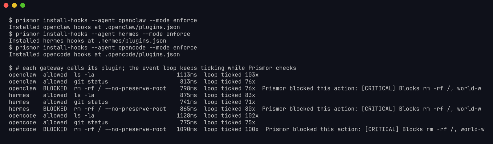
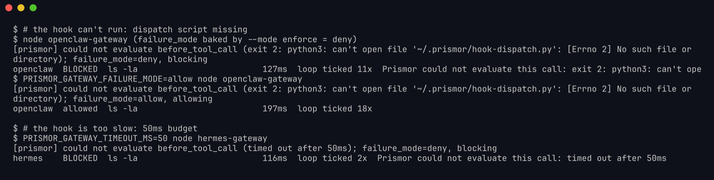
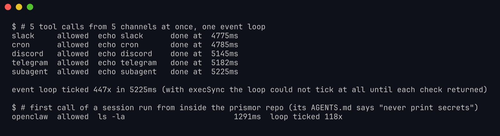

# Gateway plugins: OpenClaw, Hermes and OpenCode

OpenClaw, Hermes and OpenCode don't run a shell command per hook the way Claude Code or Cursor do. They load a JavaScript plugin into one long-running Node process. That process serves every channel at once, like Slack, Telegram, cron and subagents. `prismor install-hooks` writes that plugin for you. This page covers what the plugin does on each tool call, what happens when Prismor can't answer, and how to check it on your own machine.

## Install

```bash
prismor install-hooks --agent openclaw --mode enforce   # or: hermes, opencode
```

| Agent | Plugin | Registered in |
|---|---|---|
| OpenClaw | `prismor/runtime/openclaw-plugin/index.js`, plus `~/.openclaw/hooks/prismor/handler.js` for inbound messages | `.openclaw/plugins.json` |
| Hermes | `prismor/runtime/hermes-plugin/index.js`, plus `~/.hermes/hooks/prismor/handler.js` for inbound messages | `.hermes/plugins.json` |
| OpenCode | `prismor/runtime/opencode-plugin/index.js` | `.opencode/plugins.json` |

Re-run `install-hooks` after upgrading Prismor so the plugin picks up the new code.

## What happens on a tool call

1. The gateway calls the plugin before the tool runs (`before_tool_call`, or `tool.execute.before` for OpenCode).
2. The plugin starts `prismor hook-dispatch` **in the background** and waits for it without blocking the event loop. Other channels keep working while the check runs.
3. The answer is one of three things:

| Result | How the plugin knows | What the gateway sees |
|---|---|---|
| **allowed** | exit 0 | the call runs |
| **blocked** | exit 2 and a `Prismor blocked…` line | the call is blocked, with Prismor's reason |
| **could not evaluate** | anything else: timeout, missing binary, a crash, or Python failing to start | a `[prismor] could not evaluate …` line in the gateway log, then `failure_mode` decides |

## When Prismor can't answer: `failure_mode`

`install-hooks` sets `failure_mode` from `--mode`:

- `--mode enforce` → `deny`: a pre-tool call Prismor couldn't check is **blocked**.
- `--mode observe` → `allow`: the call runs.

Either way the reason is logged, so a broken install is visible instead of silently switching protection off. Message hooks (`message_sending`, inbound `message:received`) can't block, so for them it's only logged.

You can change it without reinstalling by setting env vars on the gateway process:

| Env var | Default | Effect |
|---|---|---|
| `PRISMOR_GATEWAY_FAILURE_MODE` | from `--mode` | `deny` or `allow` |
| `PRISMOR_GATEWAY_TIMEOUT_MS` | `10000` | how long one check may take before it counts as "could not evaluate" |

A cold first call can take a few seconds on a small box, so don't set the timeout below about 5000 in enforce mode.

## Check it yourself

You don't need a running gateway. Node can load the plugin and call it the same way the gateway does. From the workspace where you installed:

```bash
node -e '
const m = require(process.argv[1]);
let ticks = 0; const t = setInterval(() => ticks++, 10);
m.before_tool_call({ toolName: "Bash", toolInput: { command: process.argv[2] }, sessionId: "check" })
  .then(r => { clearInterval(t); console.log(r, "event loop ticked", ticks, "times"); });
' "$(pwd)/prismor/runtime/openclaw-plugin/index.js" "ls -la"
```

For OpenCode, call `m({})["tool.execute.before"]({ tool: "bash", args: { command: "ls -la" } })` instead. It throws on a block.

### 1. Safe calls run, dangerous ones are blocked



Each line shows how long the check took and how many times the event loop ticked meanwhile, at one tick per 10ms. A non-zero count means the gateway kept serving other channels while Prismor checked.

### 2. A broken install is logged, not silently allowed



To reproduce it, temporarily rename `~/.prismor/hook-dispatch.py`, or set `PRISMOR_GATEWAY_TIMEOUT_MS=50`, and run the check above. Look for the `[prismor] could not evaluate` line on stderr, then restore the file.

### 3. Many channels at once



Five calls from five channels ran together and the loop kept ticking the whole time. With the old synchronous plugin, the loop couldn't tick at all until each check finished.

## Troubleshooting

| You see | Meaning | Fix |
|---|---|---|
| `[prismor] could not evaluate … exit 2: … can't open file …hook-dispatch.py` | The dispatch script is gone, often after a cleanup or a new venv | `prismor install-hooks --agent <agent> --mode <mode>` |
| `… exit 127 …` | The interpreter path in the plugin no longer exists | Re-run `install-hooks` from the Python environment Prismor is installed in |
| `… timed out after 10000ms …` | The check was too slow, usually a cold first call on a small box | Raise `PRISMOR_GATEWAY_TIMEOUT_MS`, and check `prismor status` for slow stages |
| The gateway fails to load the plugin with a `SyntaxError` | The plugin was generated by Prismor 1.55.1 or older | Upgrade, then re-run `install-hooks` |

See also: [OpenClaw](openclaw.md), [Hermes cloaking](hermes.md), [MCP mirror for OpenCode](mcp-gateway.md).
