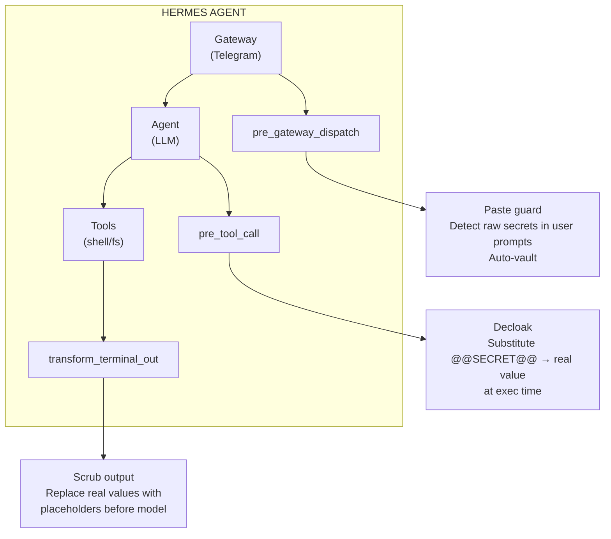
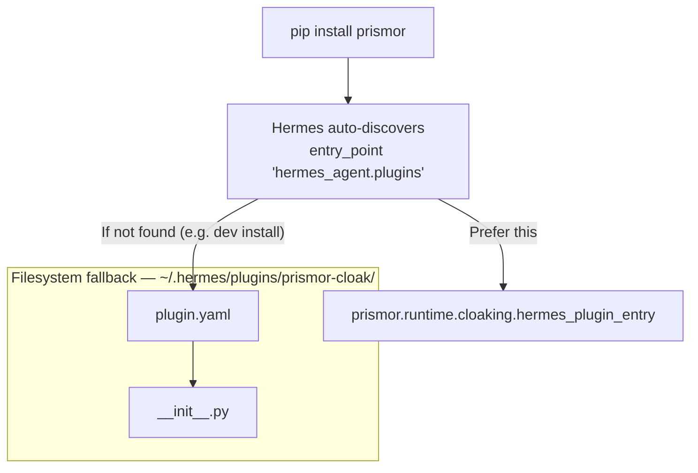

# Hermes Agent Cloaking Integration

**Status:** ✅ Shipped (v1.6.0)

Prismor's secret cloaking layer is available for [Hermes Agent](https://hermes-agent.nousresearch.com) (Nous Research's AI agent platform). This doc covers setup, architecture, and behavior.

---

## Overview

Hermes Agent supports two plugin discovery mechanisms for Python plugins:

1. **pip entry point** — when `prismor` is pip-installed, Hermes auto-discovers the `prismor-cloak` plugin via the `hermes_agent.plugins` entry-point group defined in `pyproject.toml`. No filesystem setup needed.

2. **Filesystem install** — `prismor cloak install --agent hermes` copies the plugin files to `~/.hermes/plugins/prismor-cloak/` and enables it in Hermes' `config.yaml`.

Both paths run the same code: the filesystem plugin's `__init__.py` is a verbatim copy of `prismor.runtime.cloaking.hermes_plugin_entry`, kept self-contained so it loads even when Hermes cannot import `prismor` (a test fails if the two drift).

---

## Setup

```bash
# Option A: pip install + auto-discovery (recommended)
pip install prismor

# Register your first secret
prismor cloak add stripe_key
```

```bash
# Option B: explicit filesystem install
pip install prismor
prismor cloak install --agent hermes --scope user
```

```bash
# Install for both Claude Code + Hermes in one command
prismor cloak install --agent all
```

### Verify

```bash
prismor cloak status
```

Expected output:

```
CLOAKING
──────────────────────────────────────────────────
Claude Code:    installed
Config:         ~/.claude/settings.json
Events:         UserPromptSubmit, PreToolUse, PostToolUse
Hermes Agent:   installed
Plugin dir:     ~/.hermes/plugins/prismor-cloak/
Hooks:          pre_tool_call, transform_terminal_output, transform_tool_result, pre_gateway_dispatch
Secrets dir:    ~/.prismor/secrets/
Registered:     1 placeholder(s)
```

### Uninstall

```bash
prismor cloak uninstall --agent hermes
prismor cloak uninstall --agent all    # removes both
```

---

## Architecture



### Hooks

| Hook | Phase | What it does |
|------|-------|-------------|
| `pre_gateway_dispatch` | Before any user message reaches the LLM | Detects raw secrets in pasted prompts, auto-vaults them, replaces with `@@SECRET:auto_xxx@@`, re-sends sanitized prompt |
| `pre_tool_call` | Before a tool executes | Substitutes `@@SECRET:name@@` with real value; detects and blocks raw secrets in tool arguments, auto-vaults them |
| `transform_terminal_output` | After shell command output | Scans stdout/stderr for raw secret values, replaces them with `@@SECRET:name@@` before the model sees the result |
| `transform_tool_result` | After any tool result | Same scrub logic as transform_terminal_output but covers all tool result types |

---

## Everyday Use

The flow is fully automatic — you mostly do nothing:

- **Paste a secret into Telegram** → the `pre_gateway_dispatch` hook detects it, vaults it, and re-sends the sanitized version. The agent only sees `@@SECRET:auto_xxxx@@`.
- **The agent emits a raw secret in a command** → `pre_tool_call` denies the call, vaults the value, and tells the agent to use the placeholder.
- **The agent uses a placeholder** → `pre_tool_call` substitutes the real value at execution time; `transform_terminal_output` scrubs it back out of the output.
- **You can bypass the paste guard** by prefixing the message with `!!allow `.

---

## Integration Details

### Plugin Discovery

Hermes discovers the plugin via two mechanisms:



### Entry Point

Registered in `pyproject.toml`:

```toml
[project.entry-points."hermes_agent.plugins"]
prismor-cloak = "prismor.runtime.cloaking.hermes_plugin_entry:register"
```

### Plugin Manifest

```yaml
# prismor/runtime/cloaking/hermes-plugin/plugin.yaml
name: prismor-cloak
version: 1.0.0
kind: standalone
hooks:
  - pre_tool_call
  - post_tool_call
  - transform_terminal_output
  - transform_tool_result
  - pre_gateway_dispatch
```

### Code

- `prismor/runtime/cloaking/hermes_plugin_entry.py` — shared `register()` function consumed by both pip discovery and filesystem install
- `prismor/runtime/cloaking/hermes_installer.py` — `install()`/`uninstall()`/`status()` for filesystem-level setup (copies plugin files, enables in Hermes config, sets env vars)
- `prismor/runtime/cloaking/hermes-plugin/__init__.py` — self-contained copy of `hermes_plugin_entry.py` for the filesystem install path
- `prismor/runtime/cloaking/hermes-plugin/plugin.yaml` — plugin manifest with hook declarations

---

## Test Plan

- [x] pip install → Hermes auto-discovers `prismor-cloak` entry point
- [x] `prismor cloak install --agent hermes` → filesystem install succeeds
- [x] `prismor cloak status` → shows Hermes as `installed`
- [x] `pre_gateway_dispatch` hook detects and auto-vaults pasted Stripe/OpenAI/AWS keys
- [x] `pre_tool_call` hook substitutes `@@SECRET:stripe_key@@` → real value at exec time
- [x] `transform_terminal_output` scrubs real values from tool output
- [x] `!!allow ` prefix bypasses paste guard
- [x] `prismor cloak uninstall --agent hermes` → clean removal
- [x] Agent sees `@@SECRET:auto_xxx@@` not the raw pasted secret
