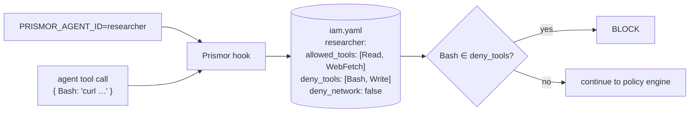

# IAM (Agent Identities)

Prismor IAM gives each agent a **named identity with a permission profile** —
the tools it may use, the tools it is denied, whether it may touch the network,
and which paths it may reach. When several agents share a workspace (Claude for
coding, a read-only research bot, a CI reviewer), IAM constrains each to only
what it needs.

Implementation: [`prismor/runtime/iam.py`](../prismor/runtime/iam.py).

---

## How it works



The active identity comes from the `PRISMOR_AGENT_ID` environment variable. If it
is unset, no IAM restrictions apply beyond the base Prismor policy. Each tool call
is checked against the resolved profile and blocked if it violates it — this runs
*in addition to* the normal policy engine.

> **Trust boundary.** `PRISMOR_AGENT_ID` is inherited by the agent being
> constrained, so IAM guards **cooperative or misconfigured** agents, not a
> fully adversarial one that can rewrite its own environment. It is a
> least-privilege guardrail, not a sandbox. Pair it with `enforce` mode and OS
> isolation for stronger boundaries.

---

## Config

Profiles live in YAML. Resolution order (project wins over global):

1. `~/.prismor/iam.yaml` — global, user-level
2. `.prismor/iam.yaml` — per-project

```yaml
agents:
  readonly-bot:
    allowed_tools: [Read]
    deny_tools: []
    deny_network: true
    allowed_paths: ["**"]

  researcher:
    allowed_tools: [Read, WebFetch, WebSearch]
    deny_tools: [Bash, Write, Edit]
    deny_network: false
    allowed_paths: ["**"]

  code-reviewer:
    allowed_tools: [Read, Bash]
    deny_tools: [Write, Edit, WebFetch, WebSearch]
    deny_network: true
    allowed_paths: ["**"]
```

| Field | Meaning |
|---|---|
| `allowed_tools` | Tools the identity may use. |
| `deny_tools` | Tools explicitly blocked (takes precedence). |
| `deny_network` | If true, network tool calls are blocked. |
| `allowed_paths` | Glob(s) of paths the identity may read/write. |

---

## Quick start

```bash
# 1. Scaffold a config (global, or --scope project)
prismor iam init
prismor iam init --scope project

# 2. Edit it to define your identities, then activate one:
export PRISMOR_AGENT_ID=researcher

# 3. Inspect
prismor iam list                 # all identities; marks the active one
prismor iam show researcher      # the resolved permission profile

# 4. Test an action before trusting it
prismor iam check researcher --type command --value "rm -rf /"
prismor iam check researcher --type network --value "https://api.example.com"
prismor iam check readonly-bot  --type write   --value "./out.txt"
```

`prismor iam check` returns `ALLOW` or `BLOCK` (with the rule that fired) and
sets the exit code accordingly — handy for testing a profile in CI before
deploying an agent under it.

---

## When to reach for IAM vs. scoped rules

| Use | Reach for |
|---|---|
| A **persistent** role that should always have the same powers | **IAM** (this doc) — set `PRISMOR_AGENT_ID` and define it once. |
| A **per-session, task-derived** restriction for one run | [Scoped Agent](scoped-agent.md) — rules are synthesized from the task. |

They compose: an IAM profile sets the standing floor, scoped rules tighten it
further for a single session.

---

## Rules on the end user

IAM profiles allow or deny whole tools. To decide on a call's arguments, its
target, or the user's roles ("refunds over 500 need finance"), write a rule with
a [`when:` attribute condition](attribute-conditions.md).

## See also

- [Scoped Agent](scoped-agent.md) — session-scoped, task-derived rules
- [Prismor](prismor-runtime.md) — the base policy engine IAM layers on top of
- [CLI Reference](cli-reference.md) — all commands at a glance
