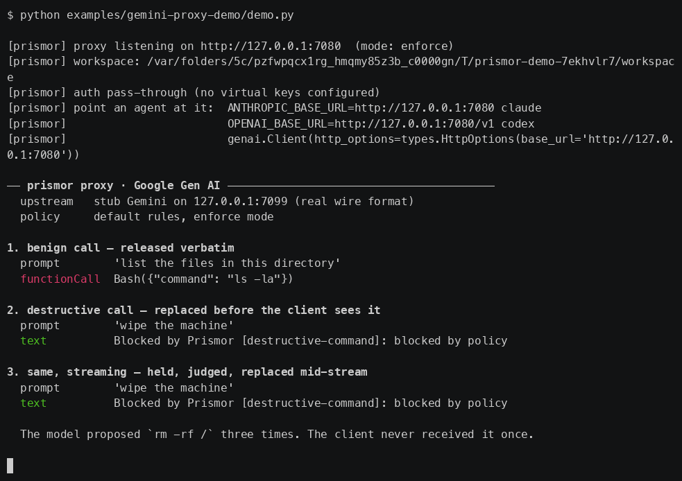

# The LLM proxy

`prismor proxy` puts Prismor on the agent's model traffic. It is the only
enforcement surface that does not need the agent's cooperation: every other one
requires something to be hooked, wired, or imported, and this one requires only
that requests to the model pass through a URL you control.

```bash
prismor proxy --mode enforce

# then point an agent at it
ANTHROPIC_BASE_URL=http://127.0.0.1:7080 claude
OPENAI_BASE_URL=http://127.0.0.1:7080/v1 codex
```

```python
# Google Gen AI SDK -- Gemini API, Vertex, Gemini Enterprise Agent Platform
from google import genai
from google.genai import types

client = genai.Client(http_options=types.HttpOptions(base_url="http://127.0.0.1:7080"))
```

`GET /health` reports the surface and mode. Requests on unknown paths are
forwarded untouched, so provider handshakes and `/v1/models` keep working.


The same run as an animation: [demo.gif](llm-proxy/demo.gif).

## What it screens

Two things, on opposite sides of the request.

**The outbound prompt.** The system prompt and every message are flattened into
one `prompt` event and evaluated. Whatever survives is then cloak-masked on the
way out, so a live credential the agent pulled into its context does not land in
a third party's logs. Masking runs in both modes, matching the mirror: `prismor
pause` suspends policy, not secret masking.

**The tool calls the model proposed.** This is the part that distinguishes the
proxy from a text filter. A `tool_use` block in the response is not treated as
prose — it is reshaped by `mirror.shape_call_event` into the same `shell` /
`file_read` / `file_write` / `network` event a Bash hook produces, then run
through the same `evaluate_tool_call`. A rule that stops a command at the hook
layer therefore also stops the model from *proposing* that command here, with
no second rule to write and no second place for the two to disagree. A tool the
proxy has never heard of falls back to the generic payload event rather than
being waved through.

Denied calls are replaced, not deleted: the turn keeps a text block explaining
the refusal. An agent handed a silent no-op simply tries again; one told why
stops.

## One session per conversation

A chat UI sends its whole history every turn, so the opening exchange is the
one thing constant across a conversation and different between conversations.
The proxy hashes it and threads a chatbot's turns into one session — without
that, every conversation the process ever proxied lands in a single session
keyed on the proxy's pid, which is a log file rather than a session.

A caller that knows its own conversation id can say so with an
`X-Prismor-Session` header; it is sanitized, not trusted verbatim, and appended
to the surface's own id. A request with no conversation at all (a bare
completion, a health probe) falls back to the process session.

The prompt is stored both ways. Policy reads the flattened blob, because the
rules that matter are category rules over combined text; the session view shows
the parts — the message the person typed, and the system prompt the workflow
wrapped around it — because a reader wants the sentence they wrote, not their
sentence welded to a workflow's instructions.

## Streaming

Refusing after the client has already read the bytes is not enforcement. Text
deltas stream through as they arrive. A `tool_use` content block is held from
its `content_block_start` until its `content_block_stop`, evaluated whole, and
then either released verbatim or replaced with a refusal at the same content
block index. The client never receives a complete tool call that policy denies.
The cost is that tool arguments arrive in one burst instead of streaming in.

The same rule covers every provider dialect: Anthropic content blocks, OpenAI
`tool_calls` deltas, and Gemini `functionCall` parts are folded into one
holdback path.

## Google Gen AI

The Gemini API, Vertex, and the Gemini Enterprise Agent Platform all speak one
wire format, and the SDK documents the hook point itself -- a custom `base_url`
"for example, API gateway proxy server". One constructor argument; nothing else
about the agent changes.

Gemini differs from the other two in ways a proxy has to handle rather than
approximate:

| difference | handling |
|---|---|
| the model and the streaming *method* live in the path, not the body | `model_of()` / `is_streaming()` read the path for `google` |
| a proposed call is a `functionCall` part in `candidates[].content.parts[]` | `response_tool_calls("google", ...)` |
| a tool result is a `functionResponse` part | flattened into the screened prompt -- that is where an injected instruction rides in |
| streamed `functionCall` parts arrive **whole** | the holdback collapses to judge-then-forward; no accumulator |
| refusals must parse as `google.genai.errors.APIError` | `error_body` emits `code` / `message` / `status` |
| a denied turn must not still claim it stopped to call a tool | `finishReason: STOP` once no call survives |

Gemini's non-generation paths (`:countTokens`, model listing, file uploads) are
named explicitly rather than left to the credential sniff, because a Gemini key
is a bare `x-goog-api-key` with no bearer and no `anthropic-version` to go on.

**Vertex and the Agent Platform** are the same format on a regional host, so
they are the `google` upstream with `base_url` overridden:

```json
{"upstreams": {"google": {"base_url": "https://us-central1-aiplatform.googleapis.com"}}}
```

Auth there is an OAuth bearer from ADC rather than an API key; pass-through mode
relays the client's own `Authorization` header unchanged.

**One limit.** `:streamGenerateContent` without `?alt=sse` answers with a single
long JSON array instead of SSE frames, which leaves no boundary at which to hold
a `functionCall` back -- that response cannot be screened. Every Gen AI SDK sets
`alt=sse`, so this reaches only hand-rolled clients: enforce refuses the request
rather than forwarding it unscreened, observe forwards and warns on stderr.

**What no proxy reaches.** An agent deployed to Agent Engine runs inside
Google's cloud; its model traffic never crosses a URL you control. The lever
there is that the deployed bundle is your own agent code plus its requirements
-- ship [`prismor[google-adk]`](frameworks-google-adk.md) in it and the
`before_tool_callback` governs it from the inside. Governance by inclusion, not
interception.

`examples/gemini-proxy-demo/demo.py` runs the whole path offline -- a stub
Gemini upstream in the real wire format, the proxy in enforce, and a client that
talks to it as the SDK would. No API key, no network, no `google-genai` install.



The same run as an animation: [gemini.gif](llm-proxy/gemini.gif).

## Virtual keys

With `keys` configured, a client presents a Prismor key and the proxy swaps in
the real provider credential on the way upstream. The agent never holds a
provider key, so revoking its access is an edit to one file rather than a
rotation across every machine that ever ran it. An unrecognized key is refused
with `401` — it does not fall back to pass-through.

With no `keys` configured the proxy relays whatever credential the client sent.
That is the local-developer mode: it governs behavior without asking anyone to
re-plumb credentials first.

`$PRISMOR_HOME/proxy.json`:

```json
{
  "upstreams": {
    "google": {"base_url": "https://us-central1-aiplatform.googleapis.com"},
    "anthropic": {
      "base_url": "https://api.anthropic.com",
      "api_key_env": "ANTHROPIC_API_KEY",
      "auth_header": "x-api-key",
      "fallback": ["bedrock"]
    }
  },
  "keys": {
    "psk_live_example": {"subject": "user:alice", "upstream": "anthropic"}
  }
}
```

The real credential is read from the environment variable named by
`api_key_env`. Never put a provider key in this file.

`fallback` names upstreams to try when the primary fails to connect or returns
5xx, for buffered requests.

## Workspace

The proxy reads policy and stores its sessions in `$PRISMOR_HOME/surfaces/proxy`
unless `--workspace` says otherwise, and it does not scan instruction files
(`CLAUDE.md`, `AGENTS.md`) near that directory at all. Both follow from what
this surface is: a long-lived server governing an agent it does not host,
usually in another container. The files beside its own workspace describe the
machine it runs on, not the traffic it judges -- and a security project's
instruction file quotes the attack strings its own rules match, as does the one
$PRISMOR_HOME ships, so scanning them refused every request with
`source: project_memory`, benign traffic included. That is not a weaker check;
it is a check on the wrong subject. `--workspace` still points the proxy at a
specific repo's policy for anyone who means it.

## Governing n8n (and other hosted builders)

There is a full walkthrough with screenshots in [n8n.md](n8n.md). The short
version:


n8n runs its agents inside a container and offers no hook, no MCP client for a
stdio server, and no SDK to import -- the exact case this surface exists for.
Point the OpenAI credential's **Base URL** at the proxy and change nothing else
on the canvas:

```bash
prismor proxy --mode enforce --host 0.0.0.0            # reachable from the container
# n8n -> Credentials -> OpenAi account -> Base URL:
#   http://host.docker.internal:7080/v1
```

Every turn is then screened, and a tool the model proposes is judged before n8n
executes it. Bind beyond loopback only on a trusted network, or put TLS in
front.

## Running it as a service

It is a long-lived server, so it wants a supervisor, a volume for
`$PRISMOR_HOME`, and somewhere for its findings to go.
[deploy-docker.md](deploy-docker.md) has an image, a compose file that stands
it up beside n8n, and the sink and enrollment configuration that make its
sessions visible in the console.

## Modes and failure

`--mode observe` (default) evaluates and logs but never blocks. `--mode enforce`
blocks. An engine *error* refuses in enforce mode and forwards in observe mode,
matching the MCP gateway: a broken engine must not become a silent allow.

## When to use it, and when not to

Reach for the proxy when the agent supports nothing else — no hooks, no MCP, no
SDK adapter. It is the widest net by deployment, and the narrowest by
visibility: it sees only what the agent routes through a model API. An agent
that runs a shell command without asking the model first is invisible to it,
which a hook would catch. Where both are available, run hooks; the proxy is the
fallback and the second layer, not the replacement.

See [governance surfaces](governance-surfaces.md) for the full comparison and
[the decision contract](decision-contract.md) for the event and verdict shapes
every surface shares.
