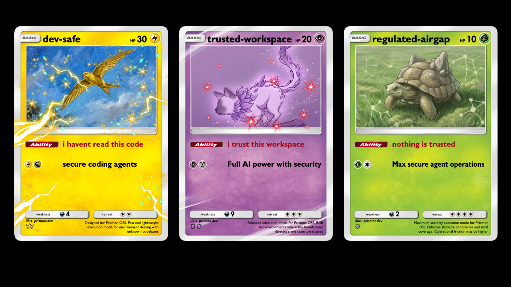

# Governance modes

A **mode** is a named security posture. `prismor mode apply <id>` compiles it
into `.prismor/policy.yaml` and `.prismor/agents.yaml` — setting enforcement,
egress, tool access, tag rules, the sandbox and the data boundary together,
in one command.



A mode is **not** a new enforcement path. It writes the same primitives the
policy engine already reads, so `PolicyEngine.evaluate` never learns that modes
exist. That indirection is the point: six policy axes hand-assembled per project
is how a security tool ends up configured wrong. Three named postures, each with
an honest residual-risk statement, is something a developer can actually choose
between.

```bash
prismor mode list               # the three postures, with coverage and friction
prismor mode explain dev-safe   # the full trade, including what it does not stop
prismor mode apply dev-safe     # compile it into this workspace
prismor mode show               # what this workspace runs, and any drift
```

`prismor setup` offers this choice directly: pick **enforce** and the wizard
shows these three with their coverage and friction bars, falling through to the
rule-by-rule picker only if you choose `custom`.

---

## The three modes

| | `dev-safe` | `trusted-workspace` | `regulated-airgap` |
|---|---|---|---|
| **Intent** | Known developer destinations only | Broad autonomy, guarded at the edges | No network, no shell |
| **Coverage** | 31% (25/80 rules) | 34% (27/80 rules) | 100% (80/80 rules) |
| **Friction** | 9% | 9% | 90% |
| **Enforcement** | observe default | observe default | enforce, all rules |
| **Egress** | default deny, ~35 dev hosts | default deny, ~35 dev hosts | default deny, nothing allowed |
| **Sandbox** | enforce, network allowlist, read-only root | observe, network bridge, writable root | enforce, no network, read-only root |
| **Tools denied** | none | none | `Bash`, `WebFetch`, `WebSearch` |
| **Tools gated** | none | none | `Write`, `Edit` |
| **Best for** | Feature branches, PR review, OSS contribution | Trusted internal repos, local Docker work | Regulated repos, PII/PHI, review-only analysis |
| **Not for** | Private-index installs, multi-cloud infra setup | Repos ingesting untrusted content or PII | Any workflow where the agent must build or test |

Coverage is computed from the real enforcing-rule count, and friction is pinned
to the measured interruption rate over a benign command corpus in
`tests/test_modes.py`. Neither number is hand-written marketing.

Note that coverage and friction do **not** move together. `dev-safe` and
`trusted-workspace` cost about the same in day-to-day interruptions while
protecting against different things — the first controls *where data can go*,
the second controls *what the agent can touch*. The jump to `regulated-airgap`
is where the trade turns sharp: ten times the friction for three times the
coverage.

---

## `dev-safe` — "I haven't read this code"

Everyday feature work, bug fixes, and PR review. `git` and `gh` work, every
major registry resolves, test suites fetch their fixtures and browser binaries,
and docs are readable — but an agent that gets injected cannot reach a host
nobody put on the list to post what it read.

**Protects:** secret exfiltration (no route to an unlisted host), secrets in
payloads (the data boundary stops them leaving a tool call), destructive
commands, the lethal trifecta (web/MCP ingest then critical action), and supply
chain (dependency confusion, URL installs, typosquats). Read-only inspection
never prompts.

**Costs you:** a vendor API outside the list needs an explicit entry; a private
index URL is denied rather than prompted; adding a package prompts for approval.
Without Docker the sandbox only observes, though rules still enforce.

**Does not stop:** exfiltration through the channels it allows — and that list
is wide. An injected agent can still read `.env` and paste it into a public
GitHub issue via `api.github.com`, which is allowlisted by design. This is a
control on arbitrary destinations, not on trusted ones. Keeping a secret out of
the model's context is a separate job, and needs `prismor cloak add`.

## `trusted-workspace` — "I trust this workspace"

Fast internal work in a closed-source repo you trust: building, running
microservices under Docker, executing tests, debugging. The agent gets room to
move; the two things it cannot do casually are install packages and read
credentials.

**Protects:** credential access (`.env`, `~/.aws`, SSH keys need a human),
package installs (nothing enters the tree unattended), privilege escalation
(`sudo`, setuid, `su` denied outright), and the data boundary.

**Costs you:** every dependency change stops for consent; debugging a credential
issue needs `prismor unlock`; an unlisted vendor API needs an explicit entry.

**Does not stop:** code it lets the agent execute. A malicious build script
(`setup.py`, `Makefile`, npm `preinstall`) runs with the agent's own reach.
Indirect injection sitting in internal code comments or a database dump can
steer the agent into writing a subtle logic bug or a backdoor, which no
destination allowlist detects.

## `regulated-airgap` — "nothing is trusted"

Environments under SOC 2, HIPAA, or the EU AI Act, handling PII, PHI, or core
IP. The agent reads and edits files inside the workspace root and does nothing
else. Every write is a decision a human signs off on.

**Protects:** network egress (nothing leaves the machine at all), shell
execution (`Bash` denied outright), every file write (gated on human approval),
with an Ed25519-signed, hash-chained audit trail for evidence.

**Costs you:** no shell, so no tests, builds, or `git`; no looking anything up
mid-task; a ten-file refactor is ten approval prompts.

**Does not stop:** the friction itself, which is the real risk. A mode this
tight is one people route around — the realistic failure is a developer running
`prismor uninstall-hooks` to get through an afternoon, which removes every
control at once rather than one. An offline agent is also still steerable:
poisoned context in a repo file needs no network to work.

---

## Trying a mode before you commit to it

Observation is a modifier, not a mode. `--observe` compiles the full posture
with nothing enforcing, which answers "what would this block?" instead of only
"what does Prismor see?":

```bash
prismor mode apply regulated-airgap --observe   # full posture, nothing blocks
prismor mode apply regulated-airgap --dry-run   # print the policy, write nothing
```

For the same question asked against real history rather than future work, replay
your existing transcripts through the policy:

```bash
prismor ingest --discover --no-persist          # what the policy would have blocked, per rule
```

## Drift

`prismor mode show` reports when a hand edit has moved the policy away from its
mode, and prints the `--force` re-apply that resets it. It also reports when the
sandbox was **skipped** because Docker isn't installed — rules, egress and tag
rules still apply, but commands run unsandboxed, which is worth knowing before
you rely on the posture.

```bash
prismor mode show
prismor mode apply dev-safe --force    # reset to the mode's definition
```

## Adding a mode

Modes are data, not code. `prismor/runtime/modes.yaml` is the source of truth —
add an entry there and it works, with nothing to change in the engine. The
schema is documented in the file's own header comment. Two invariants the
compiler enforces:

- A mode that writes `egress` wholesale must carry the cloud-metadata deny
  entries forward; `_check_metadata_deny` fails the compile if a hand edit ever
  loses them.
- Any mode setting `tool_tags.enabled: true` must also set
  `tool_tags.inference_enabled` explicitly, since inheriting the default
  resolves every workspace file read to `untrusted_content` and turns the
  trifecta rule into "read anything, then do anything → block".

Every mode must state its `residual_risk`. A mode that claims no downside is a
mode nobody should trust.

---

## Related

- [`policy-layers-and-exemptions.md`](policy-layers-and-exemptions.md) — how a mode's output interacts with org policy and the non-overridable floor
- [`network-isolation.md`](network-isolation.md) — the egress axis in detail
- [`tool-tags.md`](tool-tags.md) — the tag-rule axis in detail
- [`governance-surfaces.md`](governance-surfaces.md) — where a mode's policy gets enforced
- [`cli-reference.md`](cli-reference.md) — the full command map
