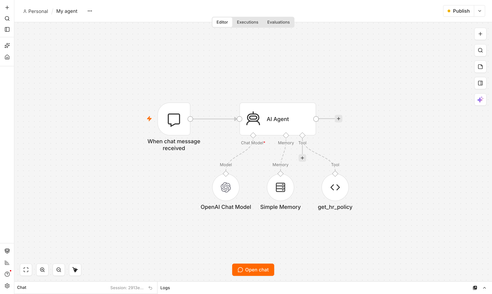
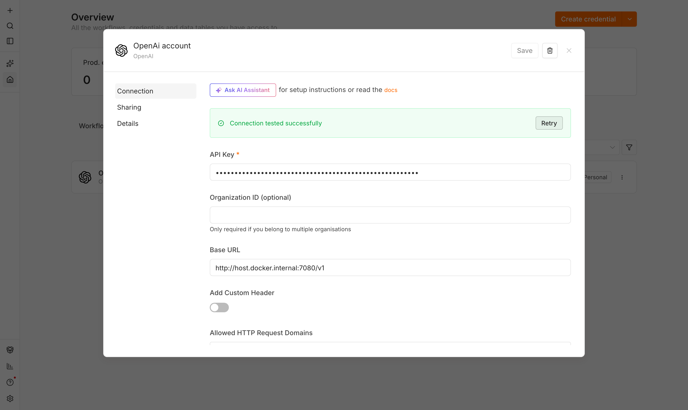
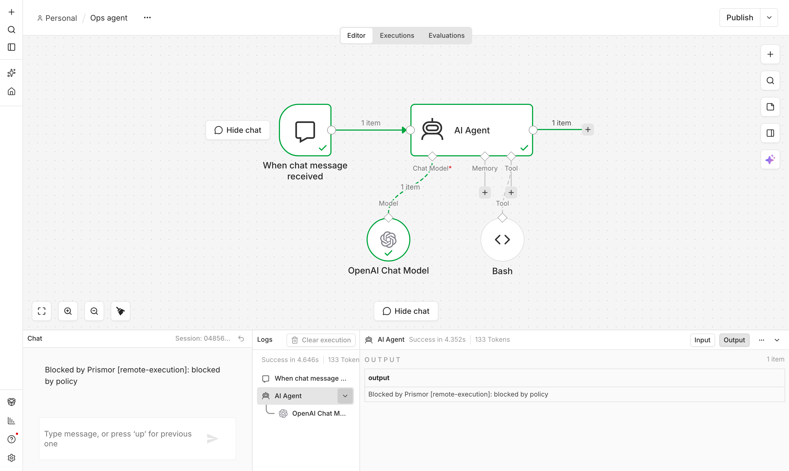

# Governing an n8n agent

n8n builds agents that Prismor cannot hook. There is no hook protocol, no place
to import an SDK adapter, and its MCP client speaks HTTP rather than the stdio
transport `prismor mcp-gateway` serves. The workflow also runs inside a
container, so the machine-level surfaces that govern a local coding agent never
see it.

The [LLM proxy](llm-proxy.md) is the surface for exactly this case. It needs
nothing from the agent except that its model traffic pass through a URL you
control — which for n8n is one field on a credential. The canvas does not
change, the workflow does not know Prismor is there, and every tool call the
model proposes is judged before n8n executes it.



## Start the proxy

```bash
prismor proxy --mode enforce --host 0.0.0.0
```

`--host 0.0.0.0` is what makes the proxy reachable from inside the n8n
container; on the default loopback bind, `host.docker.internal` cannot reach it.
Bind beyond loopback only on a network you trust, or put TLS in front of it.
Start in `--mode observe` first if you want to see verdicts before they bite.

Check it is up:

```console
$ curl -s http://127.0.0.1:7080/health
{"status": "ok", "surface": "llm-proxy", "mode": "enforce"}
```

## Point n8n at it

In n8n, open **Credentials → your OpenAI account** and set **Base URL**:

```
http://host.docker.internal:7080/v1
```



That is the whole integration. Leave the API key as it is — with no virtual
keys configured the proxy relays whatever credential the client sent, so
nothing else needs re-plumbing. n8n's **Test** button should come back green;
if it reports "Couldn't connect with these settings" you are on a Prismor older
than 1.45.2, where the credential check was routed to the wrong provider.

From inside the container, confirm the hop:

```console
$ docker exec n8n wget -qO- http://host.docker.internal:7080/health
{"status": "ok", "surface": "llm-proxy", "mode": "enforce"}
```

Running n8n outside Docker? Use `http://127.0.0.1:7080/v1` instead.

## What it screens

Two things, on opposite sides of each turn.

**The outbound prompt.** The system message and every chat message are
flattened into one event and evaluated, then cloak-masked on the way out, so a
credential the workflow pulled into context does not land in OpenAI's logs.

**The tool calls the model proposed.** This is the part a text filter cannot
do. A proposed tool call is reshaped into the same `shell` / `file_read` /
`file_write` / `network` event a Bash hook produces and run through the same
policy — so a rule that stops a command at the hook layer also stops the model
from *proposing* it inside n8n, with no second rule to write.

Ordinary work is untouched. Asking the HR agent a question it has a tool for
returns the tool's answer:

```console
$ curl -s -X POST 'http://localhost:5678/webhook-test/<webhook-id>/chat' \
    -H 'Content-Type: application/json' \
    -d '{"action":"sendMessage","sessionId":"demo","chatInput":"How many annual leave days do I get?"}'
{"output":"You are entitled to 24 days of paid annual leave per calendar year,
which is accrued monthly. You can carry over up to 5 unused days to the next
year. All leave requests should be submitted to your manager at least 7 days
in advance."}
```

Give an agent a shell tool and ask it to install something the usual way, and
the tool call is refused before n8n runs it. The agent answers with the reason,
and the tool node never executes — note that `Bash` carries no check mark in
the run below:



Denied calls are replaced rather than deleted on purpose: an agent handed a
silent no-op simply tries again, while one told why it was refused stops.

### Name tools so they can be judged

That block happens because the proposed call is recognisable as a shell
command. Prismor reshapes a proposed tool call by its name and arguments — a
tool called `Bash` taking a `command` becomes the same `shell` event a Bash
hook produces, and the shell rules apply to it unchanged. A tool whose
arguments do not carry that shape falls back to a generic payload event, which
is still screened for injection and secrets but is not a shell command as far
as the shell rules are concerned.

n8n's Code Tool takes a single free-text `query` by default, which is exactly
that weaker case. Turn on **Specify Input Schema** and give the tool the
argument it really takes:

```json
{
  "type": "object",
  "properties": {
    "command": { "type": "string", "description": "The shell command line to run" }
  },
  "required": ["command"]
}
```

The schema is worth setting on any tool that wraps a real capability —
executing a command, reading a file, calling a host. It is what lets one rule
table cover the hook layer and the proxy at once, instead of two.

## Keep it running

The proxy is a long-lived server, so run it under whatever supervises your
other services. On macOS, a launch agent is enough:

```xml
<!-- ~/Library/LaunchAgents/dev.prismor.proxy.plist -->
<key>ProgramArguments</key>
<array>
  <string>/path/to/prismor</string>
  <string>proxy</string>
  <string>--mode</string><string>enforce</string>
  <string>--host</string><string>0.0.0.0</string>
  <string>--agent-name</string><string>n8n-hr-agent</string>
</array>
<key>RunAtLoad</key><true/>
<key>KeepAlive</key><true/>
```

`--agent-name` registers this proxy as a named agent instance, which is what
gives you the per-agent kill switch and per-agent policy in the console.

## What this does not cover

The proxy sees only what the workflow routes through a model API. An n8n node
that runs a command or calls an API on its own — an Execute Command node, an
HTTP Request node the agent never asked the model about — is invisible to it,
because nothing about that step ever reaches the proxy. Nor does it stop a tool
the agent decides to call for reasons of its own after the turn is allowed: the
verdict covers the call the model proposed, not what the node then does with
it.

It is the widest net by deployment and the narrowest by visibility. Where a
real hook is available, run hooks; the proxy is the surface for agents that
offer nothing else, and n8n is one of them.

See [Governance Surfaces](governance-surfaces.md) for the full comparison,
and [the LLM proxy](llm-proxy.md) for virtual keys, streaming behaviour and
the failure modes.
