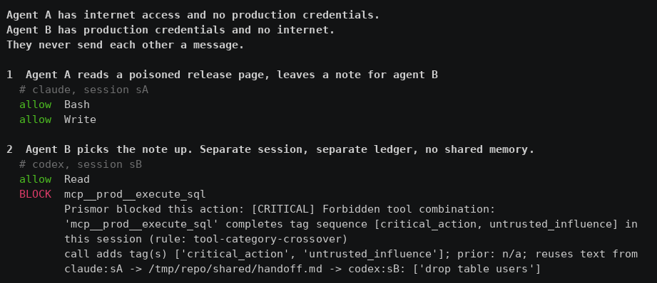
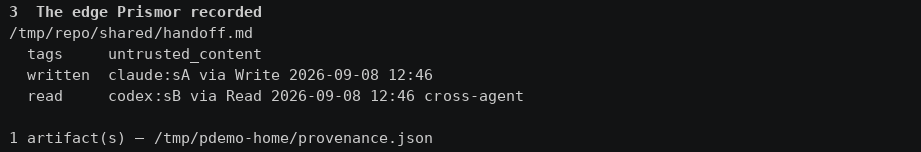
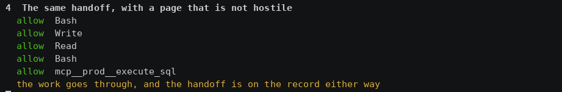

# Tool Tags & Tag Rules (policy as code)

Every tool an agent can call — built-in, shell, or MCP — carries zero or more
**tags** describing what it does: `untrusted_content` (reads
attacker-influenceable input), `critical_action` (sends / publishes / destroys
externally), or any tag you define (`private_data`, `external_comms`, …).
**Tag rules** then declare which tag combinations must never complete — the
classic "lethal trifecta" (read untrusted content, then act externally) is just
the default rule.

The call that *completes* a forbidden combination is blocked before it
executes. Everything is observable first (`mode: observe`), then enforceable.

Two things make this hold up outside a demo:

- **Influence.** Reading a page and later running a command is what a working
  day looks like; the default rule blocks only when the command's own arguments
  reuse text from what was read. See [Influence](#influence-what-separates-a-sequence-from-an-attack).
- **Provenance.** A session is not the boundary. Tags follow the files agents
  write to each other, so an agent acting on another agent's output inherits
  what that agent had read. See [Cross-agent flow](#cross-agent-flow).

## How a tool gets its tags (precedence)

| Tier | Source | Who controls it |
|------|--------|-----------------|
| 1 | Explicit map — `tool_tags.tags` in policy (exact, glob, or regex) | You / org admin |
| 2 | Server-declared — `_meta.prismor.tags` on the MCP tool definition, read by `prismor mcp-gateway` | MCP server author |
| 3 | Built-in defaults — well-known tools (`WebFetch`, `mcp__*__send_email`, …) | Prismor |
| 4 | Inference — a network response is untrusted; a call the rules judged destructive is critical | Prismor |

The first non-empty tier wins, so an admin's explicit tag always beats a
server's self-declaration, which beats generic globs. Nothing is ever left
completely untagged unless you disable tiers 3–4.

Check what resolved where:

```console
$ prismor tags list
TOOL                        TAGS                 TIER
Bash                        (untagged)           -
WebFetch                    untrusted_content    default
mcp__crm__read_customers    private_data         _meta
mcp__Gmail__send_email      critical_action      explicit
```

Inference is deliberately thin. Being a shell call, a file write, or an MCP
result is not by itself evidence of anything: replaying the old, wider
inference over 391 real development sessions blocked 213 of them, because
`grep` counted as critical for being shell and the agent's own transcripts
counted as untrusted for sitting outside the workspace. What a tool *is* comes
from tiers 1–3; what a call *does* comes from the rule engine's own verdict
(`destructive_command`, `remote_execution`, `privilege_escalation`, …).

### Declaring tags from an MCP server (`_meta`)

If you author an MCP server, self-declare tags on each tool definition and the
gateway picks them up automatically — no spreadsheet, no manual mapping:

```json
{
  "name": "read_customers",
  "inputSchema": { "type": "object" },
  "_meta": { "prismor": { "tags": ["private_data"] } }
}
```

Also honored: `_meta.tags` and `annotations["prismor/tags"]`. Tags are
sanitized (lowercase, `[a-z0-9][a-z0-9_.-]*`, max 8) — a server can suggest
tags but can never override the org map or inject arbitrary strings.
Disable the tier with `meta_tags_enabled: false`.

## The rule language

One rule per line. Three keywords. That's the whole grammar:

```
rule    :=  TAG ( then|with TAG )*  [ -> block|warn ]
```

- **`with`** — unordered co-occurrence: both tags appearing anywhere in the
  session is enough.
- **`then`** — ordered sequence: the left step must occur *before* the right.
- **`-> block`** (default) or **`-> warn`** — warn logs the finding but never
  blocks, even in enforce mode.
- The call completing the **final step** is the one blocked/warned.
- `not`, `or`, `within`, `count` are reserved for future use.

```yaml
settings:
  tool_tags:
    enabled: true
    mode: enforce            # observe (log only) | enforce (terminal block)
    tags:
      mcp__Gmail__read_email: [untrusted_content]
      mcp__Gmail__send_email: [critical_action]
      mcp__crm__*: [private_data]
    rules:
      - "untrusted_content then critical_action -> block"
      - "untrusted_content then private_data then external_comms -> block"
      - "web_read with secrets_access -> warn"
```

More examples:

```
untrusted_content with critical_action -> block    # either order
untrusted_content then critical_action -> block    # read first, act later
untrusted_content with private_data then external_comms -> block
customer_pii then external_comms                   # implicit -> block
```

### `with` vs `then`, concretely

Session: `send_email` (critical) → `read_email` (untrusted) → `send_email`.

- `untrusted_content with critical_action` fires at call **2** — both tags now
  co-occur, order irrelevant.
- `untrusted_content then critical_action` allows calls 1–2 and fires at call
  **3** — the first critical action *after* untrusted content entered the
  session. Ordered rules cut false positives when a critical-first pattern is
  normal for your agents.

### Backward compatibility (guaranteed)

The pre-existing form keeps working forever and can be mixed with `rules:`:

```yaml
    incompatible:                       # same as "a with b -> block"
      - [untrusted_content, critical_action]
```

Both compile to the same internal representation. A policy with only
`incompatible` behaves byte-for-byte as before; if *neither* list is set, the
default red/blue pair applies. Old runtimes simply ignore an unknown `rules:`
key — there is no fleet flag day.

## Influence: what separates a sequence from an attack

`untrusted_content then critical_action` describes an afternoon of ordinary
work as accurately as it describes an attack. What distinguishes them is
whether the untrusted content is *steering* the action:

```
fetched a changelog, then pushed your own branch     sequence     ordinary
fetched a page, then ran the command the page named  influence    attack
```

Prismor tags the second case `untrusted_influence`: the critical call's own
arguments reuse a distinctive phrase (a token 3-gram) from untrusted content
the session read. This is why an injected instruction is catchable at all — the
attacker's command has to reach the tool call more or less verbatim, or it
stops doing what the attacker asked.

So the shipped defaults are:

```yaml
rules:
  - "critical_action with untrusted_influence -> block"   # act on what was read
  - "untrusted_content then critical_action -> warn"      # the sequence itself
```

Replayed over 426 real development sessions with provenance active, the
shipped defaults block **none** and warn on 4. The same corpus under the old
rule blocked 213. Widening the replay's idea of a critical action well past
what the engine actually tags -- counting every `git push`, `psql`, `rm -rf`
and `sudo` -- raises that to 1, a session where a fetched page happened to
contain the phrase "git push origin" before the agent pushed its own branch.

Against a suite of twelve cross-agent attacks (SQL through a note, a dropper,
exfiltration, an authorized_keys append, a remote hijack, a three-hop chain, a
subagent acting on its parent's read) and ten benign lookalikes, the defaults
deny 8 attacks and 0 benign runs: precision 1.00, recall 0.67, FPR 0.00. The
four it does not deny are actions no rule tags critical at all -- see the
limits below.

The finding names the source, not just the fact:

```
Forbidden tool combination: 'mcp__prod__execute_sql' completes [critical_action, untrusted_influence]
  call adds tag(s) ['critical_action', 'untrusted_influence'];
  via: claude:s-1a2b -> /repo/shared/handoff.md -> codex:s-9f3e;
  reuses text from claude:s-1a2b -> /repo/shared/handoff.md: ['drop table users']
```

Set `influence_enabled: false` for the older, blunter behaviour (any sequence
blocks).

Six things are deliberately not influence, each of which was a false block
before it was excluded:

| Not influence | Why |
|---|---|
| Prose a command quotes | An agent that reads docs and commits a message quoting them has quoted the page, not obeyed it. `git commit -m`, `gh issue --body` and `echo` are prose; `psql -c` and `bash -c` are payloads, and stay in scope. |
| A human-readable argument | The same line, drawn for structured tool calls, which have no quoting to draw it with: `body`, `summary`, `description`, `comment`, `message`, `title` and `text` are read by a person; `command`, `query`, `path`, `url` and `content` are acted on by the tool. Replying to a thread that quotes it, filing a ticket from a bug report, putting a search result in an issue — copying text is the task, so reuse is present by construction. |
| A read from this machine | Polling your own dev server on `localhost` is not reading attacker content, whether it arrives through `curl` or through a browser tool's URL. Cloud metadata is excluded from that carve-out, and an org that names the tool in `tool_tags.tags` overrides it. |
| A URL inside a script | `http`/`https` start every URL as well as httpie, so a heredoc full of links read as a fetch and everything it printed became untrusted. |
| A write with no trace of the read | A session that read one page does not thereby mark every file it later touches. An artifact carries untrusted content only when its bytes show some. |
| A session-wide injection flag | A `prompt_injection` finding anywhere in a session used to make every later critical call count as influenced, with no reused text and no chain tying the two together. Influence is text reuse, always. Injected content is added to the gram store on the finding itself, so a call that does act on it is still denied — and can still name the phrase. |

Remaining limits:

- It is a phrase match. A generic phrase that appears both in a fetched page
  and in an ordinary command can still produce a false block; that is the one
  case left in 426 sessions, and only under a critical set wider than the one
  that ships.
- A payload that legitimately travels in a prose field is not denied. An
  injected message posted verbatim to a channel reaches `body`, which the gate
  does not read. The sequence rule still warns, and `data_boundary` still
  screens what is in it.
- It only fires on calls the engine already judges critical. `npm publish`,
  `git remote set-url` and `rm -rf` of an arbitrary directory produce no
  finding at all, so an injected one is not denied. Widening that set widens
  the blocking surface with it, so tag the tools you care about
  (`tool_tags.tags`) rather than leaning on inference.

## Cross-agent flow

Agents that never exchange a message still communicate whenever one writes a
file another reads. The filesystem is the protocol, and per-agent permissions
cannot see it:

```
        internet                          production
            |                                  ^
            v                                  |
       [ agent A ]  --write-->  plan.md  --read-->  [ agent B ]
     (no prod access)                          (no internet access)
```

Neither agent holds both capabilities; the pair does.



Prismor defines an agent-to-agent interaction without reference to any
agent-to-agent protocol:

> B communicated with A when B consumed state whose provenance includes A.

A write records which session wrote the file and what that session was
carrying; a read hands those tags to the reading session, which turns the
cross-agent case into the in-session one the rules above already govern. The
reader also picks up two tags of its own:

| Tag | Meaning |
|-----|---------|
| `via.artifact` | this call is reading a file another session wrote |
| `from.<agent>` | ...written by that agent |

which lets a policy be stricter about crossing an agent boundary than about the
content itself, with no new grammar:

```yaml
rules:
  - "via.artifact then critical_action -> warn"        # approve handoffs
  - "data.secret with via.artifact -> redact"          # never hand a credential on
  - "from.research-agent then critical_action -> block"
```

Shell-only agents are covered on both sides, and both halves are needed. A
fetch marks its target file untrusted *and* makes the fetching session
untrusted, so the note that session writes next carries the tag; redirects,
`tee`, output flags and `cp`/`mv` destinations are recorded as writes, and
arguments that exist as files count as reads. Running the two-agent handoff
with live agents is what found this: Codex reaches the web through Bash, so
with only the file half the downloaded page was marked and the handoff note
written from it was not, and the injected instruction reached the second agent
intact.

Inspect what was recorded:



Every cross-agent read also emits an observe-mode `provenance` finding
(ruleId `cross-agent-flow`), so the causal edge is in the console whether or not
a rule fires.

Limits, deliberately:

- **Same machine.** The store lives under `$PRISMOR_HOME`, shared by every
  agent on the device. Carrying edges between machines needs the control plane.
- **Hooked writes only.** An editor, or an agent Prismor is not installed in
  front of, writes without leaving a record.
- **Content evidence, not session state.** A write is marked only when what it
  writes shows some trace of what the session read. That is what keeps a
  session from poisoning its own config files, and it means a handoff whose
  content Prismor never saw (a `cp`, a pipe into `tee`) is not marked.
- **A writer owns its own mark.** A session rewriting a file it wrote itself
  replaces its own tags rather than adding to them, so a file that once quoted
  a fetched page can come clean. Another agent's contribution survives, which
  is what stops that being a laundering path. Marks are about what a file
  holds now, and what it holds is what was last written to it.

The same handoff with a page that is not hostile goes through untouched, and
is still recorded:



The whole sequence as an animation: [demo.gif](tool-tags/demo.gif).

Disable with `provenance_enabled: false`.

## CLI

```console
$ prismor tags list                  # tools seen + resolved tags + tier
$ prismor tags provenance [PATH]     # who wrote what other agents are reading
$ prismor tags set 'mcp__crm__*' private_data
$ prismor tags rm  'mcp__crm__*'
$ prismor tags rules                 # active rules (DSL + legacy + default)
$ prismor tags rules add "untrusted_content then critical_action -> block"
$ prismor tags rules rm 0
$ prismor tags edit                  # interactive wizard
$ prismor tags lint                  # validate every rule expression
```

Invalid expressions fail with a caret diagnostic:

```console
$ prismor tags rules add "a then not b"
invalid rule:
  a then not b
         ^ 'not' is reserved for future use
```

### Test rules against real session logs (dry run)

Before enforcing anything, replay your recorded sessions through a candidate
ruleset. Nothing is blocked and no enforcement state is touched:

```console
$ prismor tags test --last 10
demo-session-1  2 hit(s) in 3 events
  [  2] WOULD BLOCK mcp__Gmail__send_email
        rule: untrusted_content then critical_action
        prior: untrusted_content by 'mcp__Gmail__read_email' at event 0

$ prismor tags test --rule "private_data then external_comms -> warn"   # what-if
$ prismor tags test --session <id> --fail-on-hit                        # CI gate
```

Recommended rollout: `mode: observe` → watch findings / `tags test` → tighten
tags → flip to `enforce`. An enforce block is terminal and non-overridable
(part of Prismor's safety floor).

## Semantics reference

- Any number of same-tag calls is always allowed; only *completing* a
  forbidden combination fires.
- A session that has entered the forbidden state stays restricted — every
  later call carrying a final-step tag keeps firing.
- A blocked call never executes, so its tags do not enter the session ledger
  (one denied call can't "use up" the rule).
- `warn` rules log a `lethal_trifecta` finding but never block — even under a
  device-level enforce override.
- Findings: category `lethal_trifecta`; ruleId `tool-category-crossover`
  (legacy/default rules) or `tag-rule:<id>` (expression rules). Both are part
  of the non-overridable enforcement floor.
- Per-session state lives under the Prismor data dir in `trifecta/<session>.json`;
  `prismor tags test` uses an in-memory replay ledger and never touches it.
- Influence grams live beside it in `trifecta/<session>.grams.json`, hashed —
  untrusted text is never written to disk. Artifact provenance is device-wide,
  in `provenance.json`.
- Grams carry the event index that recorded them, and only content from
  strictly earlier events counts: the session pre-pass has already written this
  event's own content by the time the call is screened, so without the bound a
  call would report itself as steered by itself.
- Tags that describe a *call* (`critical_action`, `untrusted_influence`,
  `egress.*`, `dest.*`) never travel with an artifact; content tags
  (`untrusted_content`, `data.*`, and your own) do.
- `prismor setup` regenerates `.prismor/policy.yaml`. Keep a hand-written
  `tool_tags` block in the org policy, or re-add it after running setup.
